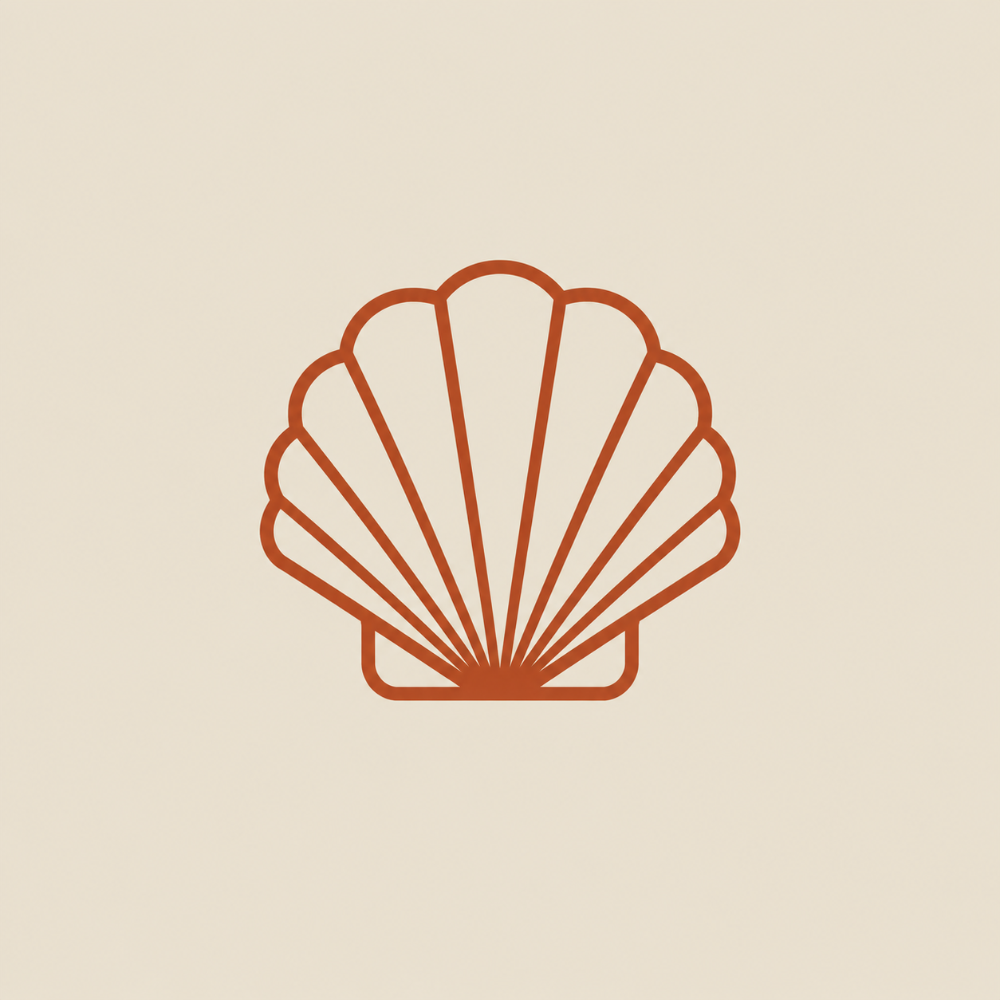
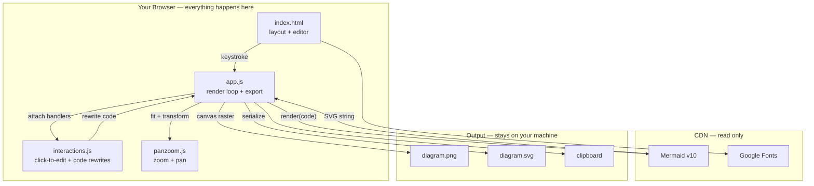

<div align="center">



<br><br>

<pre style="display: inline-block; text-align: left; font-weight: bold; background: none; border: none; padding: 0;">
  ___   ___    _    _     ___  ___
 / __| / __|  /_\  | |   | __|/ __|
 \__ \| (__  / _ \ | |__ | _| \__ \
 |___/ \___|/_/ \_\|____||___||___/
</pre>

<br>

**Paste Mermaid code. Get a high-res image. That's it.**

[](#)
[](LICENSE)
[](#)
[](#)
[](#)
[](https://mermaid.js.org)
[](#)

*No framework · No bundler · No server · One HTML file and three scripts*

</div>

---

## 🔥 The Problem

You ask an AI to diagram your architecture. It hands you a block of Mermaid code.

Now you just want a **PNG for your slide deck**.

So you go looking for an online converter and hit the usual wall — sign up, log in, hit a rate limit, watch it export a blurry low-res image, or paste your private architecture into somebody's server.

**Scales fixes this.** Paste the code, get a crisp image, close the tab. Nothing leaves your browser, because there is no server to send it to.

---

## ✨ What It Does

Scales is a single-page **Mermaid diagram exporter** that runs entirely in your browser.

1. **Paste anything** — flowchart, sequence, class, ER, state, gantt, pie, git graph, journey. The type is auto-detected; there's nothing to select.
2. **See it instantly** — the preview re-renders on every keystroke (~9ms), with no debounce delay.
3. **Frame it** — scroll to zoom, drag to pan. The diagram is re-rendered as vector at every zoom level, so it never goes blurry.
4. **Export it** — PNG at 1x/2x/4x, or SVG. Transparent or white background. Download or copy to clipboard.

Plus a light visual editing layer: **click a node to change its shape** without writing bracket syntax, **click an arrow to recolor it**, or **jump straight to that element's line** in the code.

---

## 🚀 Quick Start

There is no install step. There is no build step.

```bash
git clone https://github.com/YOUR-USERNAME/scales
cd scales
```

Then **open `index.html` in your browser.** Double-click it. That's the whole setup.

> **Note:** Mermaid and the fonts load from CDN, so the first load needs a connection. Everything after that — rendering, editing, exporting — happens locally. Your diagram code is never transmitted anywhere.

Want it online? Drop the folder on GitHub Pages, Netlify, Vercel, or any static host. There's no backend to deploy.

---

## 🎛️ Features

| Feature | Details |
|---|---|
| **Live preview** | Re-renders every keystroke, ~9ms. No debounce, no lag. |
| **All diagram types** | flowchart · sequence · class · ER · state · gantt · pie · gitGraph · journey |
| **Crisp zoom** | Zoom re-renders the SVG as vector — sharp at 1000%, never a stretched bitmap |
| **PNG export** | 1x / 2x / 4x resolution multiplier |
| **SVG export** | True vector output, infinitely scalable |
| **Transparency** | Toggle white or transparent background (with a checkerboard so you can see it) |
| **Copy to clipboard** | PNG copies as an image; SVG copies as markup |
| **Shape editor** | Click a flowchart node → pick a shape → the code rewrites itself |
| **Arrow colours** | Click an edge → pick a colour → `linkStyle` is inserted for you |
| **Jump to code** | Click any element in any diagram type → its line is highlighted in the editor |
| **Honest errors** | Syntax errors show inline; your last good diagram stays on screen |

---

## 🏗️ How It Works



**Rendering:** every keystroke calls `mermaid.render()`. Each render takes a ticket, and only the newest ticket is allowed to touch the DOM — so a slow render can never overwrite a newer one.

**Exporting:** the on-screen SVG carries inline sizing from the zoom controls, so export works from a *clone* restored to its natural `viewBox`. Whatever you're looking at, the exported file is always the full diagram at full quality.

---

## 🔬 Two Bugs Worth Knowing About

Both of these bite anyone building a Mermaid exporter. Solved here:

### Blurry zoom

The obvious way to zoom is `transform: scale()` on the SVG. **Don't.** The browser rasterizes the SVG once at its layout size and then stretches that bitmap — so zooming in gives you soft, pixelated edges.

Scales instead sets the SVG's `width`/`height` in pixels and only uses `translate()` for panning. The browser re-renders the vector at every zoom level, so it stays sharp.

### Clipped text in exports

Mermaid renders labels as HTML inside `<foreignObject>` by default. When an SVG is drawn onto a canvas to make a PNG, browsers rasterize embedded HTML unreliably — **descenders get sheared off** (`p`, `g`, `y`) or the text vanishes entirely.

Fixed with `htmlLabels: false`, which makes labels native SVG `<text>`. A 12px export padding was also added, because Mermaid sizes its `viewBox` to shape *centres* — so thick borders and arrowheads sitting on the boundary got shaved off.

---

## 📂 Project Structure

```
scales/
├── index.html         # layout, theme, all styling
├── app.js             # render loop, export pipeline, UI wiring
├── interactions.js    # click-to-edit, shape swapping, code rewrites
├── panzoom.js         # zoom + pan (vector-accurate)
├── logo.png
└── docs/
    └── superpowers/
        ├── specs/     # design documents
        └── plans/     # implementation plans
```

Four files. No `node_modules`. No config.

---

## 🎨 Design

Warm editorial rather than the usual dark developer dashboard — bone paper, ink black, a single clay accent.

| Token | Value |
|---|---|
| Paper | `#E4DED2` |
| Surface | `#EFEAE0` |
| Ink | `#232019` |
| Accent (clay) | `#9E4B31` |
| Hairline | `#D2C9B9` |

Type is **Instrument Serif** for the wordmark, **Inter** for UI, **JetBrains Mono** for code. Mermaid itself is re-themed to match, so diagrams render in paper-and-clay instead of the stock lavender.

---

## 🗺️ Roadmap

### V1.0 — Core ✅
- [x] Live preview, every keystroke
- [x] PNG export at 1x / 2x / 4x
- [x] SVG export
- [x] Transparent background toggle
- [x] Copy to clipboard
- [x] Vector-accurate zoom + pan
- [x] Click-to-change node shapes (flowchart)
- [x] Arrow colouring (flowchart)
- [x] Jump-to-code (all diagram types)

### V1.1 — Quality of life
- [ ] Auto-save to `localStorage` so refresh doesn't lose work
- [ ] Diagram history — recent diagrams in the sidebar
- [ ] Theme picker — switch Mermaid colour themes
- [ ] Keyboard shortcuts (`Ctrl+S` export, `Ctrl+0` fit)

### V2 — Deeper editing
- [ ] Drag nodes to reposition
- [ ] Edit label text directly on the canvas
- [ ] Shape editing for non-flowchart diagram types
- [ ] Export presets (slide, doc, README width)

---

## ⚠️ Known Limitations

- **Shape editing is flowchart-only.** Node shapes are a flowchart concept in Mermaid — sequence, class and ER diagrams have no interchangeable shapes. Those diagrams still get click-to-highlight and jump-to-code.
- **Code rewriting is text-based.** It targets the common single-line node definition that AI tools produce. If a node can't be located unambiguously, it tells you instead of corrupting your code.
- **Needs a connection on first load** for the Mermaid CDN and fonts.

---

## 🤝 Contributing

Open source. No ads, no accounts, no telemetry, no monetisation.

It's four plain files — open one and start editing. No toolchain to learn.

---

## 👤 Author

**Kaustubh Bhoir** — Computer Engineering

[](https://www.linkedin.com/in/kaustubh-bhoir-ce/)

---

## 📄 License

MIT — use it, fork it, ship it.

---

<div align="center">
<i>"Mermaids have scales. So do your diagrams."</i>
</div>
